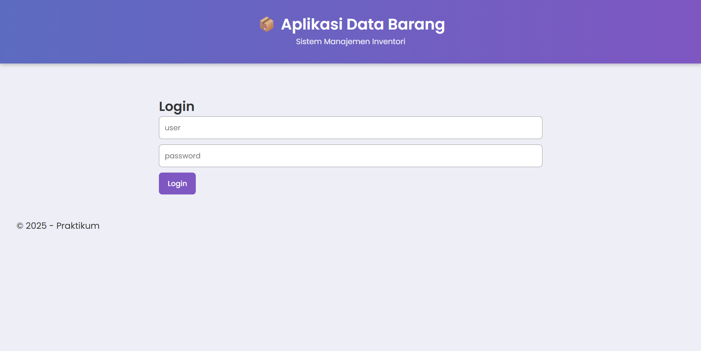
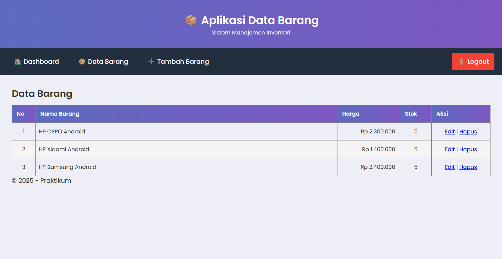
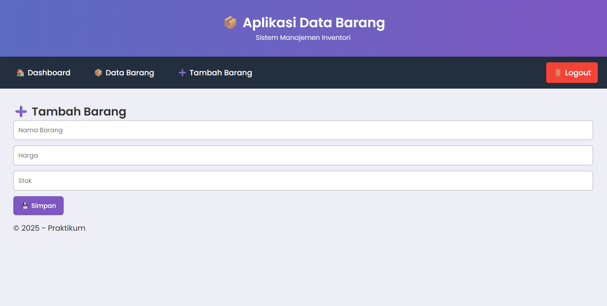

# Identitas Mahasiswa

**Nama  :** Razy Alfarisi  

**NIM   :** 312410524 

**Kelas :** TI.24.A5  


## 1. Tujuan Praktikum

### Pada praktikum ini Anda mempelajari dan mengimplementasikan:

- Konsep modularisasi program PHP

- Pemisahan kode menjadi template (header, footer, layout)

- Penggunaan struktur folder modular

- Routing sederhana menggunakan index.php?page=...

- Integrasi CRUD dari Praktikum 8 ke sistem modular


## Praktikum 9

## 2. Persiapan Project

Buat folder baru di:

htdocs/lab9_php_modular/

## Kemudian buat struktur direktori sesuai file praktikum:

## 3. Membuat Template (Modularisasi)

### 3.1 header.php

File ini digunakan sebagai template bagian atas halaman, berisi elemen header dan navigasi.

```php
<!DOCTYPE html>
<html lang="en">
<head>
    <meta charset="UTF-8">
    <title>Modular PHP</title>
    <link rel="stylesheet" href="assets/css/style.css">
</head>
<body>

<div class="container">
<header>
    <h1>Modularisasi Menggunakan Require</h1>
</header>

<nav>
    <a href="index.php?page=home">Home</a>
    <a href="index.php?page=about">About</a>
    <a href="index.php?page=kontak">Kontak</a>
    <a href="index.php?page=user/list">Data Barang</a>
</nav>
```
### 3.2 footer.php

Template bagian footer untuk semua halaman.
```php
<footer>
    <p>&copy; 2024 - Universitas Pelita Bangsa</p>
</footer>

</div>
</body>
</html>
```

## 4. Routing Menggunakan index.php

### Routing memungkinkan setiap halaman dipanggil melalui URL:

index.php?page=user/list

```php
<?php
$page = isset($_GET['page']) ? $_GET['page'] : 'home';

include 'modules/header.php';

$filepath = 'modules/' . $page . '.php';

if (file_exists($filepath)) {
    include $filepath;
} else {
    echo "<h2>Halaman tidak ditemukan</h2>";
}

include 'modules/footer.php';
?>
```

## 5. Halaman Konten

### 5.1 Home

modules/home.php

<h2>Ini Halaman Home</h2>
<p>Selamat datang di sistem modularisasi PHP.</p>

### 5.2 About
<h2>Ini Halaman About</h2>
<p>Informasi mengenai aplikasi.</p>

### 5.3 Kontak
<h2>Ini Halaman Kontak</h2>
<p>Hubungi kami melalui email support@example.com</p>

## 6. Implementasi CRUD (Modularisasi Praktikum 8)

###  tugas praktikum:

“Implementasikan konsep modularisasi pada kode program praktikum 8 tentang database.”

Maka seluruh file CRUD dipindahkan ke folder:

modules/user/


## Isinya:

### 6.1 list.php

Menampilkan data barang dari database.


### 6.2 tambah.php

Form tambah barang.


### 6.3 ubah.php

Form edit barang.


### 6.4 hapus.php

Menghapus data tanpa tampilan.

```php
<?php
include "../../koneksi.php";
$id = $_GET['id'];

mysqli_query($conn, "DELETE FROM data_barang WHERE id_barang='$id'");

header("Location: ../../index.php?page=user/list");
?>
```

## 7. Cara Menjalankan Project

### Langkah-langkah:

Jalankan XAMPP → Apache + MySQL

### Buat database:

latihan1


Import tabel dari praktikum 8

Buka browser

http://localhost/lab9_php_modular/


### Navigasi halaman lewat routing:

Fungsi	URL
Home	?page=home
About	?page=about
Kontak	?page=kontak
List Data Barang	?page=user/list
Tambah Barang	?page=user/tambah
Ubah Barang	?page=user/ubah&id=1

## SCREENSHOT HASIL

## 1. Menjalankan XAMPP


## 2. Struktur Folder Project


## 3. Login


## 4. Tampilan Dashboard


## 5. Data Barang/List Add


### 6.Tampilan Tambah Barang


## Kesimpulan

Pada Praktikum 9 ini, konsep modularisasi berhasil diterapkan pada project CRUD dari Praktikum 8 dengan membagi kode program menjadi beberapa bagian terpisah yang lebih terstruktur, yaitu header, footer, routing, serta modul–modul halaman. Dengan penerapan modularisasi ini, setiap halaman aplikasi kini memiliki tampilan yang konsisten karena menggunakan template yang sama melalui file header.php dan footer.php.

Selain itu, penerapan routing menggunakan parameter index.php?page=… membuat project menjadi lebih mudah dikembangkan, lebih rapi, dan lebih mudah dibaca. Routing juga memungkinkan penambahan halaman baru tanpa harus membuat file utama yang berbeda untuk tiap tampilan.


